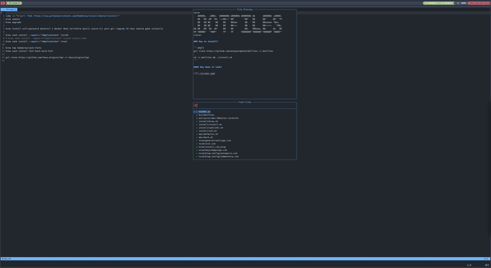

<pre>
   d8888b.  .d88b.  d888888b d88888b d888888b db      d88888b .d8888. 
   88  `8D .8P  Y8. `~~88~~' 88'       `88'   88      88'     88'  YP 
   88   88 88    88    88    88ooo      88    88      88ooooo `8bo.   
   88   88 88    88    88    88~~~      88    88      88~~~~~   `Y8b. 
db 88  .8D `8b  d8'    88    88        .88.   88booo. 88.     db   8D 
VP Y8888D'  `Y88P'     YP    YP      Y888888P Y88888P Y88888P `8888Y' 
</pre>

### How to install?

```shell
git clone https://github.com/anupvarghese/dotfiles ~/.dotfiles

cd ~/.dotfiles && ./install.sh
```

### What is in?
- [x] tmux config
- [x] neovim config
- [x] zshell config

### Credits
- [neovim](https://neovim.io/)
- [Telescope](https://github.com/nvim-telescope/telescope.nvim)
- [nvim-tree](https://github.com/kyazdani42/nvim-tree.lua)
- [nvim-compe](https://github.com/hrsh7th/nvim-compe)
- [lspsaga](https://github.com/glepnir/lspsaga.nvim)
- [lspconfig](https://github.com/neovim/nvim-lspconfig)
- [lsp-signature](https://github.com/ray-x/lsp_signature.nvim)
- [nvim-treesitter](https://github.com/nvim-treesitter/nvim-treesitter)
- [formatter](https://github.com/mhartington/formatter.nvim/)
- [gitsigns](https://github.com/lewis6991/gitsigns.nvim)
- [github-nvim-theme](https://github.com/projekt0n/github-nvim-theme)
- [nvim-autopairs](https://github.com/windwp/nvim-autopairs)

#### How does it look?


